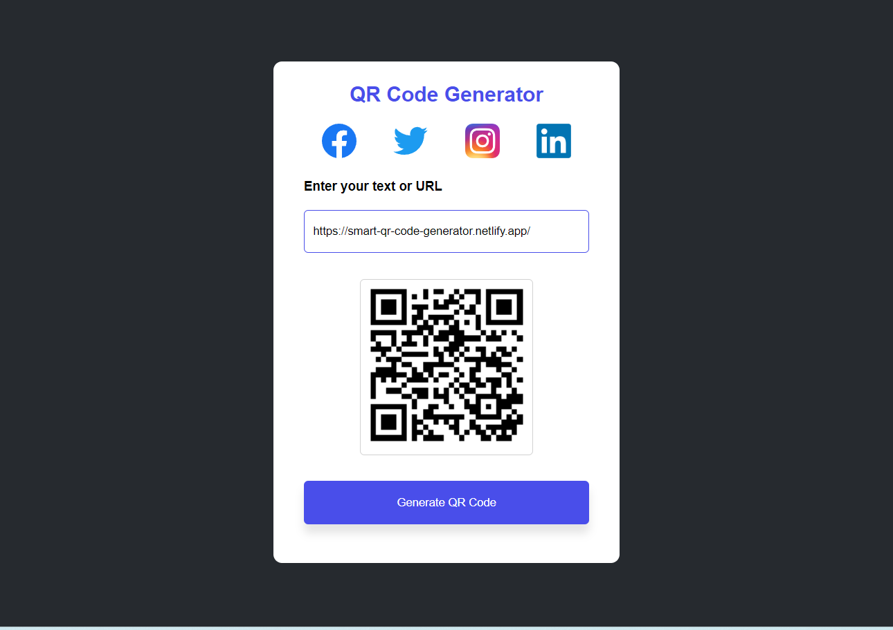

# QR Code Generator

A simple web-based QR Code Generator that allows users to generate QR codes from text or URLs. This application supports special characters and spaces in the input. It also includes social media icons (Facebook, Twitter, Instagram, LinkedIn).

## Features

- Generate QR Codes from any text or URL.
- Handles spaces and special characters in the input.
- Social media icons for Facebook, Twitter, Instagram, and LinkedIn.
- User-friendly interface with a simple design.

## Demo
Image: 
You can try the live version of the project here: [QR Code Generator](https://smart-qr-code-generator.netlify.app/)
You can learn more about project here: [Blog Post](https://medium.com/@aryangaur380/how-i-built-a-qr-code-generator-using-html-css-and-javascript-ad8c8e3a2dd8)

## Technologies Used

- **HTML5** for structuring the web page.
- **CSS3** for styling the web page and making it responsive.
- **JavaScript** for generating the QR code dynamically using an external API.
- **QR Code API**: [goqr.me API](https://goqr.me/api/) is used to generate QR codes.

## How to Use

1. Clone or download the repository to your local machine.
   ```bash
   git clone https://github.com/aryangaur380/qr-code-generator.git
